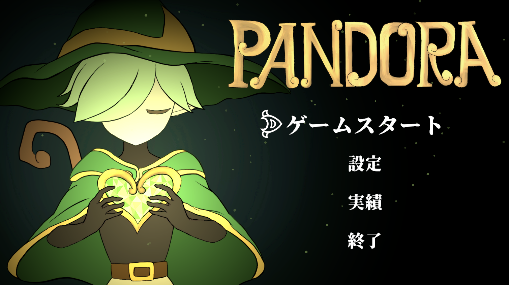

# Pandora - Source Code & Technical Documentation

## 📌 プロジェクト概要

大学 2~3 年生時、「Hollow Knight」に憧れて制作を開始した2D メトロイドヴァニア系ゲーム。
サークルでの初めてのチーム開発であり、様々な問題に直面したがどうにか遊べるラインまで仕上げた。
まだまだ未実装の機能や用意できていない画像素材が多い。いつか完成させたい作品の一つ。

### デモ動画
▶️ [YouTube で見る](https://www.youtube.com/watch?v=w49v_Ba0P9U)

---

## ⚖️ 著作権に関する重要な注記

**このリポジトリについて**

このリポジトリには **コードのみ** を公開しています。
理由：以下の有料 Unity アセットを使用しているため、
著作権・ライセンス上、完全なゲーム構成の公開ができません。

- エレメンタルビームスペルエフェクト VFX（PixPlays Studio）: ポセイドンのビーム攻撃に使用。

**完全なゲーム体験について**

以下のリンクからダウンロードしてください。

[📦 Pandora v1.0.0 - Release ページ](https://github.com/KOMIKURU/KOMIKURU-Source-Code/releases/tag/v1.0.0)

---

## 🛠️ 技術スタック

| 項目 | 内容 |
|------|------|
| エンジン | Unity 6000.4.2f1 |
| 言語 | C# |
| アーキテクチャ | ステートマシン型 |
| 主要ライブラリ | DoTween, UniTask |

---
##  開発メンバー

| 名前 | 役割 |
|------|--------|
| 中野　陽(KOMIKURU) | チームリーダー,画像素材提供,システム設計|
| さいころ | コーディング(ボス・ポセイドンのステートマシン) |
| アストラン | コーディング(雑魚敵のステートマシンをKOMIKURUと共同で開発) |
| Silver | コーディング(魔法関連) |

---

## 👤 担当部分

| 領域 | 担当度 | 説明 |
|------|--------|------|
| プログラミング | 70% | プレイヤー操作、敵AI、ゲーム管理 |
| ビジュアル | 100% | 全画像素材（キャラ、敵、UI、背景など） |
| マネジメント | 100% | チーム全体のタスク管理・進捗管理 |

---

## 💡 作品の工夫点

### 1. 階層型有限ステートマシン(HFSM)
プレイヤーも敵キャラもHFSMベースで設計。階層型になっているおかげで共通処理を絞りやすくなったり、サブステート独自の処理を特化させやすくなっている。

### 2. 画像素材はすべて手書き
私の原点は「自分の生み出したキャラクターが生き生きと動いているのを見たい」という願いそのもの。近年は画像生成AIの発展も著しい中、「だからこそ人間が自分で生み出すことの価値が高まっている」と考え、すべてのイラストに情熱を込めて描きました。決して楽ではありませんし、時間はかかりますが、それを妥協しないのがプライドというものでしょう。

### 3. チームの運営
このプロジェクトは元々友人と二人でサークルの後輩を巻き込む形で始まりました。友人がチームリーダー、私が制作・実装のリーダーとなって後輩たちとシステム設計をするといった感じで初めは運営されていました。しかし、当時の私は創作意欲に従順で、後先考えずに色んなアイデアのもと多くのコードとイラストを次々に作成していきました。私は「やる気があれば何でもできる」と突っ走り続けていましたが、この暴力的なモチベーションは「計画をしても既に先回りされている」といった感じでメンバーたちの意欲を下げてしまっていたのです。そうして、友人はこのプロジェクトから抜けていきました。私はそれを深く反省し、彼の代わりに本気でプロジェクトの運営を始めました。具体的には、対面の集団でやっていたミーティングを個人面談の形式に変えました。これは集団でミーティングしていた時に「自分の作っていない範囲の詳しい実装は知る必要がないから冗長である」と感じていたからです。Pandoraの開発においてはインターフェースとなる部分の関数だけしっかり明示されていれば実装は知る必要がない(ブラックボックス)ので、この方針を採用しました。週に1回必ず私と対面・遠隔で面談をし、評価をして、修正点と次回までのタスクを提示するというフローを順守し続けました。そうして私は上の立場に立つということ、「自分だけがやる気を持って突っ走っても誰もついてきてくれないこと」を学びました。人間には個性があり、意思があります。彼らの特性をよく見極め、適切な場所で最適な能力を最大限発揮させてやる機会を用意することもチームとして活動していくのには欠かせないことを学べたのがこのPandoraで得た一番の教訓です。

---
